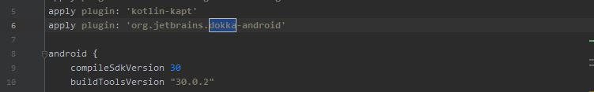
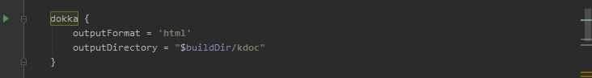
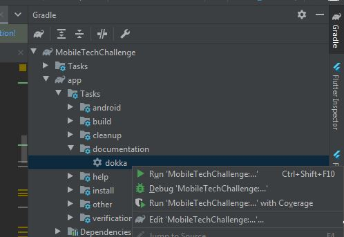
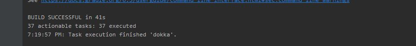
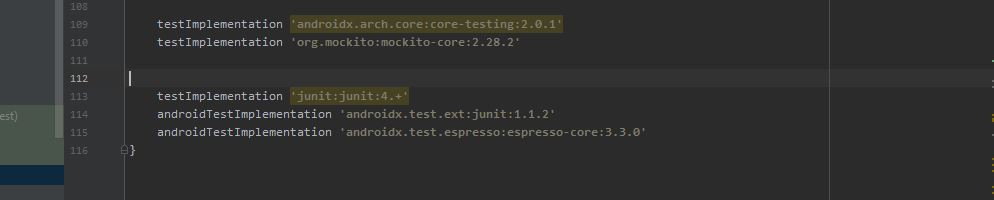
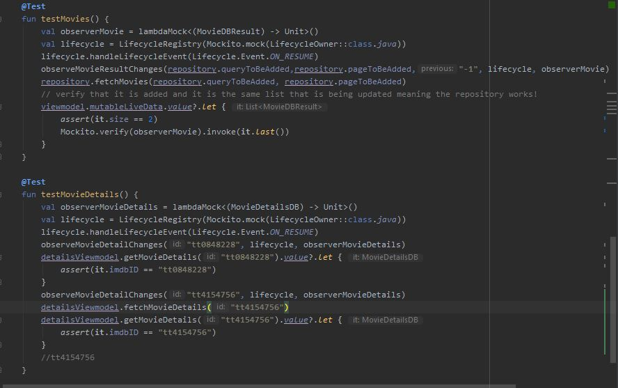
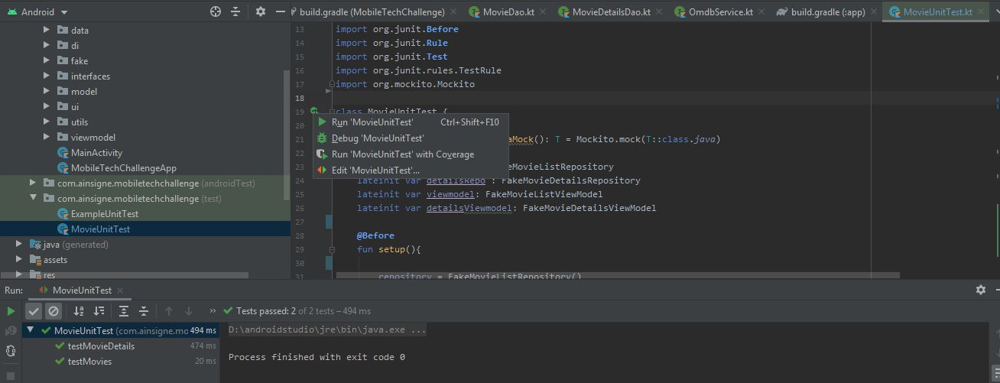

# MobileTechChallenge
Android app for displaying movies using OMDb Api https://www.omdbapi.com/

Running the app : https://developer.android.com/training/basics/firstapp/running-app

How to run the application using a real device
=================

Set up your device as follows: 

Connect your device to your development machine with a USB cable. If you developed on Windows, you might need to install the appropriate USB driver for your device.
Perform the following steps to enable USB debugging in the Developer options window:
Open the Settings app.
If your device uses Android v8.0 or higher, select System. Otherwise, proceed to the next step.
Scroll to the bottom and select About phone.
Scroll to the bottom and tap Build number seven times.
Return to the previous screen, scroll to the bottom, and tap Developer options.
In the Developer options window, scroll down to find and enable USB debugging.
Run the app on your device as follows:

In Android Studio, select your app from the run/debug configurations drop-down menu in the toolbar.
In the toolbar, select the device that you want to run your app on from the target device drop-down menu.

Figure 1. Target device drop-down menu

Click Run .

Android Studio installs your app on your connected device and starts it.

How to run on an emulator
=================

Run the app on an emulator as follows:

In Android Studio, create an Android Virtual Device (AVD) that the emulator can use to install and run your app.
In the toolbar, select your app from the run/debug configurations drop-down menu.
From the target device drop-down menu, select the AVD that you want to run your app on.

Figure 2. Target device drop-down menu

Click Run .

Android Studio installs the app on the AVD and starts the emulator. 

How to build the documentation (dokka) : https://github.com/Kotlin/dokka
=================

Build the documentation as follows:

In Android Studio, Choose the class/interface to update the documentation for. 
In the active file(class or interface), Update the documentation for its classes, parameters and functions.
Do this for all files. Once done make sure to apply the dokka plugin

Figure 3. Dokka plugin

then make sure to indicate where to indicate what output will the documentation be and where
the documentation will be saved.

Figure 4. Dokka directory

Sync gradle after. then build the documentation by choosing Gradle side tab and navigating to app/documentation/dokka and
right click on dokka and then click Run. 

Figure 5. Dokka build

It will generate the documentation after

Figure 6. Dokka finished

How to run unit tests : https://developer.android.com/training/testing/unit-testing/local-unit-tests
=================

Run the unit test as follows:

On Android Studio, Make sure that these are added to gradle

Figure 7. Gradle requirements for unit tests

Create unit test file and update the unit tests as needed on the use cases for the app
On our case we just want to know whether the results are being populated and whether the 
details for a particular movie result is updated with accurate info as well

Figure 8. Unit test code

Once that is finished, While still on the unit test file (MovieUnitTest.kt), On the bar at the left side of the code window 
Click Run and it will run the unit test for the particular file

Figure 9. Unit test running