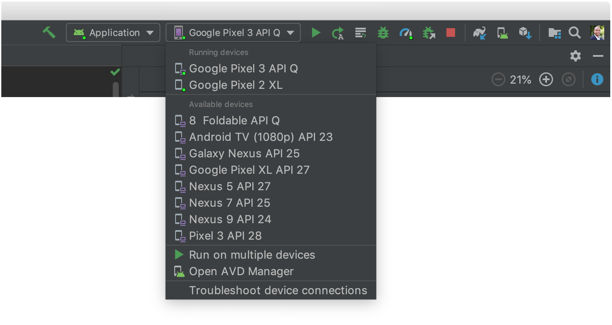

# MobileTechChallenge
Android app for displaying movies using OMDb Api https://www.omdbapi.com/

How to run the application using a real device

Running the app : [0]
[0]: https://developer.android.com/training/basics/firstapp/running-app
Set up your device as follows: 

Connect your device to your development machine with a USB cable. If you developed on Windows, you might need to install the appropriate USB driver for your device.
Perform the following steps to enable USB debugging in the Developer options window:
Open the Settings app.
If your device uses Android v8.0 or higher, select System. Otherwise, proceed to the next step.
Scroll to the bottom and select About phone.
Scroll to the bottom and tap Build number seven times.
Return to the previous screen, scroll to the bottom, and tap Developer options.
In the Developer options window, scroll down to find and enable USB debugging.
Run the app on your device as follows:

In Android Studio, select your app from the run/debug configurations drop-down menu in the toolbar.
In the toolbar, select the device that you want to run your app on from the target device drop-down menu.

Figure 1. Target device drop-down menu

Click Run .

Android Studio installs your app on your connected device and starts it.

Run on an emulator
Run the app on an emulator as follows:

In Android Studio, create an Android Virtual Device (AVD) that the emulator can use to install and run your app.
In the toolbar, select your app from the run/debug configurations drop-down menu.
From the target device drop-down menu, select the AVD that you want to run your app on.

Figure 2. Target device drop-down menu

Click Run .

Android Studio installs the app on the AVD and starts the emulator. You now see "Hello, World!" displayed in the app.
